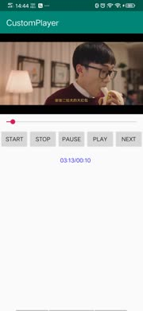

# CustomPlayer
使用FFmpeg OpenGL-ES OpenSL-ES 实现一个简单的视频播放器

#### 1.编译库
> * 编译ffmpeg 库； 
编译 ffmpeg库的脚本在 third_libray下面； 
首先要将脚本放在ffmpeg目录下，ffmpeg 切换到n4.0.3版本； 
./build_android_ffmpeg.sh all
> * 编译openssl 库； 
在third_libray中下载了openssl 库，也写了编译openssl库的方法和脚本；
#### 2.解析输入的视频ur
#### 3.分离视频流、音频流
#### 4.解码视频流，OpenGL ES和GLSurfaceView渲染
> * 获取视频的DAR；DAR就是视频的宽高比; 
[视频的宽高应该怎么看？](https://www.jianshu.com/p/9eda5e7f3fed)
#### 5.解码音频流，OpenSL ES播放
#### 6.音频、视频 同步